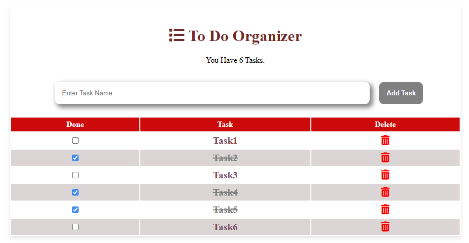

# To-Do List Web Application

## Overview
The To-Do List is a simple yet functional web application designed to help users organize and manage their daily tasks. With this application, 
users can add tasks, mark them as completed, and delete them when no longer needed. The interface is user-friendly, making it a great tool for staying productive.




---

## Features
- **Add Tasks**: Users can input task names and add them to the task list.
- **Mark as Done**: Tasks can be marked as completed using a checkbox, which applies a line-through style for easy identification.
- **Delete Tasks**: Tasks can be removed from the list by clicking the delete icon.
- **Task Counter**: Displays the total number of tasks and the count of deleted tasks.

---

## Technologies Used

### Frontend
1. **HTML**: For structuring the content of the web application.
2. **CSS**: For styling the application and ensuring a visually appealing layout.
3. **Font Awesome**: For adding icons (e.g., trash can for delete functionality).

### JavaScript
1. **Modular JavaScript**:
   - **`functions.js`**: Contains reusable functions for adding, deleting, and marking tasks as done.
   - **`main.js`**: Initializes the app and sets up event listeners for user interactions.
2. **Event Handling**:
   - Used to respond to user actions like clicking buttons and checkboxes.

---

## File Structure
```
.
|-- index.html        # Main HTML file
|-- css/
|   `-- style.css     # Stylesheet for the application
|-- js/
|   |-- functions.js  # Contains reusable task management functions
|   `-- main.js       # Initializes and controls the app
`-- README.md         # Project documentation
```

---

## How to Use
1. **Clone the Repository**:
   - Run the following command in your terminal:
     ```bash
     git clone https://github.com/Abdallah-Ali247/JS_To_Do_List.git
     ```

2. **Open the Application**:
   - Navigate to the project folder and open `index.html` in your web browser.

3. **Add Tasks**:
   - Enter a task name in the input field and click the "Add Task" button.

4. **Mark Tasks as Done**:
   - Click the checkbox next to a task to mark it as completed. The task will appear with a line-through effect.

5. **Delete Tasks**:
   - Click the trash icon next to a task to remove it from the list.

6. **View Task Statistics**:
   - The application displays the number of total tasks and the count of deleted tasks at the top of the page.

---

## Future Enhancements
- **Persistence**: Add functionality to save tasks locally using localStorage or a database.
- **Edit Tasks**: Allow users to edit existing tasks.
- **Categories**: Add support for categorizing tasks.
- **Due Dates**: Enable users to set deadlines for tasks.
- **Dark Mode**: Include a toggle for switching to a dark theme.

---

## Contributing
Contributions are welcome! Feel free to submit a pull request or report issues in the repository.

---

## Contact
For questions or suggestions, contact the project maintainer:
- **Name**: Abdallah Ali
- **Email**: [Contact Me](mailto:aa2447454@gmail.com)
- **LinkedIn**: [Follow Me ](https://www.linkedin.com/in/abdallah-ali98)

